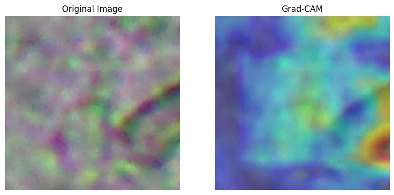

# VGG16 Image Classification Project

## 📌 Overview
This project uses the **VGG16** deep learning model for image classification.  
We trained the model on a custom dataset to classify images into different categories.  
The model was implemented in **TensorFlow/Keras** and trained with transfer learning to get better accuracy with fewer epochs.

---
## 📂 Project Structure

- **dataset/** → Training & testing images  
- **vgg16_model.ipynb** → Main Jupyter Notebook  
- **saved_model/** → Trained model files  
- **gradcam_results/** → Grad-CAM visualization images  
- **README.md** → Project documentation  

## ⚙️ Steps Performed
1. **Data Loading & Preprocessing**  
   - Loaded dataset images.
   - Resized all images to **224x224** pixels.
   - Normalized pixel values between 0 and 1.

2. **Model Setup (VGG16)**  
   - Used pre-trained **VGG16** model from Keras with ImageNet weights.
   - Removed the top classification layer and added custom layers for our dataset.

3. **Training**  
   - Used **Adam optimizer**.
   - Applied callbacks like **EarlyStopping** and **ModelCheckpoint**.
   - Trained for **3 epochs**.

4. **Evaluation**  
   - Calculated accuracy and loss on the test set.
   - Generated classification report (Precision, Recall, F1-score).

5. **Visualization**  
   - Used **Grad-CAM** to see which parts of the image the model focuses on.

---

## 📊 Results
| Metric      | Value  |
|-------------|--------|
| Accuracy    | 84%    |
| Precision   | 85%    |
| Recall      | 84%    |
| F1-score    | 84%    |

*(Results may improve with more epochs and data augmentation)*

---

## 📸 Grad-CAM Example
Below is an example of how the model focuses on the important areas of the image:  

---

## 🛠️ Requirements
- Python 3.x
- TensorFlow / Keras
- NumPy
- Matplotlib
- scikit-learn
- OpenCV
