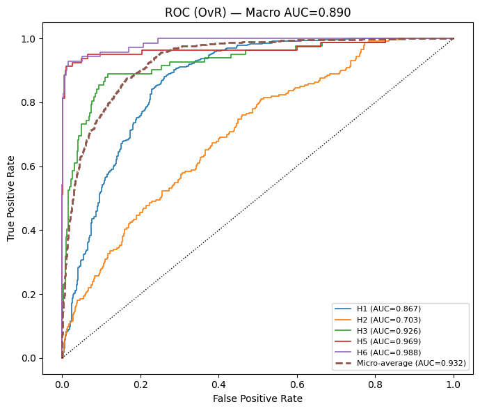
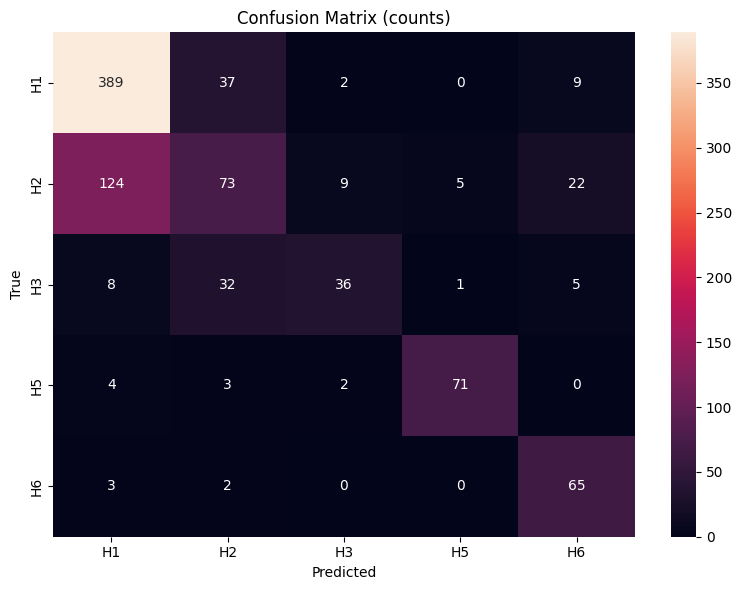

<h1 align="center">🧫 Fungal Image Classification using <span style="color:#4CAF50">VGG19</span> (Transfer Learning)</h1>

<p align="center">
  <b>Deep Learning project for microscopic fungi recognition using Transfer Learning with VGG19</b><br>
  <i>Built with TensorFlow · Keras · Python · Jupyter</i>
</p>

<p align="center">
  
  
  
  
</p>

---

## 🌟 Overview

A **transfer learning**–based approach using **VGG19** to classify microscopic images of fungal species.  
The model leverages **ImageNet pretraining**, enhanced with **Dropout**, **L2 regularization**, and **label smoothing** for improved generalization and robustness.

---

## 🧠 Model Architecture

| Component | Description |
|------------|-------------|
| **Backbone** | Pre-trained `VGG19` (include_top=False) |
| **Head** | GAP → Dropout → Dense(512, ReLU, L2) → Dropout → Dense(C, Softmax) |
| **Regularization** | Dropout, L2 Weight Decay, Label Smoothing = 0.1 |
| **Optimizer** | Adam (`1e-3` head, `1e-5` fine-tuning) |
| **Loss** | Categorical Cross-Entropy (Label Smoothing) |

🧩 *In-model augmentations (rotation, flip, zoom) are GPU-accelerated for efficient learning.*

---

## 🧬 Dataset

📦 **Source:** [Microscopic Fungi Image — DeFungi (Kaggle)](https://www.kaggle.com/)  
🧪 **Classes (5):**
1. *Candida albicans*  
2. *Aspergillus niger*  
3. *Trichophyton rubrum*  
4. *Trichophyton mentagrophytes*  
5. *Epidermophyton floccosum*  

🧹 **Preprocessing:**
- Resize → `224×224`
- Normalize → `[0, 1]`
- Augment → rotation, flipping, zooming

---

## ⚙️ Training Configuration

| Parameter | Value |
|------------|--------|
| **Epochs** | 40 |
| **Batch Size** | 32 |
| **Learning Rate** | 1e-3 → 1e-5 (fine-tune) |
| **Framework** | TensorFlow / Keras |
| **Augmentation** | Random Flip / Rotation / Zoom |

---

## 📈 Results

| Metric | Score |
|--------|--------|
| ✅ **Accuracy** | **70.29%** |
| 🎯 **Macro F1** | **70.67%** |
| 💹 **ROC AUC** | **0.932** |

🧩 *The addition of GAP + Dropout + L2 + Label Smoothing significantly reduced overfitting.*

---

## 🔍 Visual Insights

<p align="center">
  
  
  
</p>

✨ **Confusion Matrix** shows challenging class overlaps.  
📉 **ROC Curves** illustrate robust separability for most classes.  

---

## 🚀 Usage

```bash
# Clone the repository
git clone https://github.com/<your-username>/<repo-name>.git
cd <repo-name>

# Install dependencies
pip install -r requirements.txt

# Run the notebook
jupyter notebook vgg.ipynb
